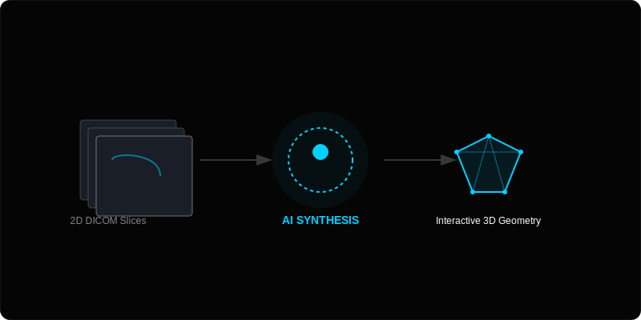

# MedMind: Dimensionalizing Medical Insights

MedMind is a high-fidelity surgical intelligence and anatomical visualization platform designed for medical students, residents, and surgical professionals. It bridges the gap between traditional 2D diagnostic imaging (MRI/CT) and 3D spatial reality, providing surgical teams and educators with the depth needed for flawless planning.

## 🧠 The Mental Model

MedMind functions as a volumetric translation layer between static diagnostic data and interactive clinical geometry.



---

## 🚀 Core Value Proposition

*   **Precision Beyond the Slice:** Automatically convert standard DICOM/medical scans into immersive, high-fidelity 3D anatomical models.
*   **Surgical Intelligence:** Enhance spatial understanding to simulate approach angles and identify risks before the first incision.
*   **Educational Clarity:** Ground theoretical knowledge in tangible spatial reality for medical students and faculty.

## ✨ Key Features

- **Automatic 2D to 3D Conversion:** Advanced volumetric rendering algorithms eliminate hours of manual reconstruction.
- **Dynamic Annotation:** Precise digital marking tools for pre-operative territory mapping and identifying anatomical variations.
- **Cloud Collaboration:** Shared live 3D sessions for interdisciplinary teamwork across different institutions.
- **AI Neural Link (Powered by Gemini):** A specialized surgical consultant providing clinical insights, landmark identification, and research grounding via Google Search.

## 🛠️ Technology Stack

- **Frontend:** React + Vite
- **Styling:** Tailwind CSS (Custom "Sophisticated Dark" Theme)
- **Animations:** Framer Motion
- **AI:** Google Generative AI (@google/genai) with Search Grounding
- **Icons:** Lucide React


<br/>

# live demo
link: [https://ais-dev-kpzlhimffjosgvbxjsb7kl-831466596400.asia-southeast1.run.app/]


#### What the video explains:
1.  **AI Reconstruction:** Watch 2D MRI slices synthesize into 3D voxels in real-time.
2.  **Tactical Markups:** See the surgical team use sub-millimeter annotation tools to plan approach angles.
3.  **Neural Link (AI):** A demonstration of the Gemini-powered consultant identifying anatomical landmarks.
4.  **Global Hub:** Multi-user collaboration across different time zones on a single high-fidelity model.

To request a live private demo for your organization, please click the **"Request Demo"** button in the application navigation bar or contact our sales department.

## 💻 Getting Started

### Prerequisites

- Node.js (v18+)
- Gemini API Key (for the AI Specialist Assistant)

### Installation

1.  Clone the repository.
2.  Install dependencies:
    ```bash
    npm install
    ```
3.  Set up your environment variables (create a `.env` file):
    ```env
    GEMINI_API_KEY=your_api_key_here
    ```
4.  Launch the development server:
    ```bash
    npm run dev
    ```

---

*© 2026 MedMind Technologies Inc. Clinical validation required. All medical models are for planning and educational purposes only.*
